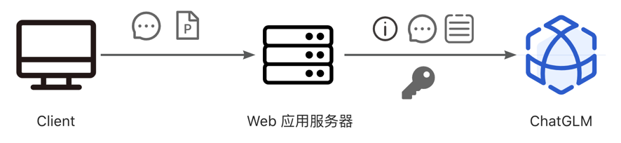
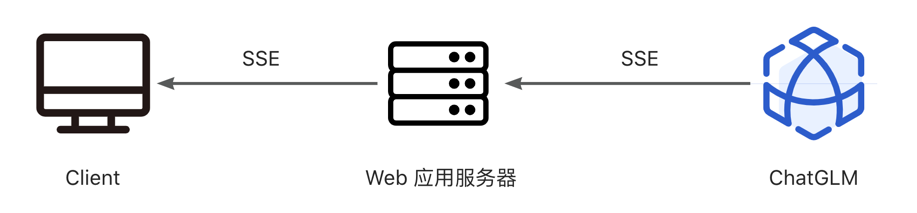

# 《PPT-Assistant 》简介

> 20组 - Project_2

### 小组概况：

小组成员：王绎豪、孙达、孙博辰、刘开鹏、刘培翔

小组导师：赵永瑞（赵导yyds）

---

这是一个基于https://github.com/apache/poi 库和ChaGLM大模型开发的PPT分析助手，用户可以上传自己的PPT给AI学习分析里面的内容，用户通过与AI对话，实现PPT文字内容查询，查找媒体动画，AI会直接告诉你。快来使用你的PPT-AI助手吧！

## 特性

1. 用户操作简单
2. 功能创新，PPT对接大语言模型
3. 快速了解、学习PPT内容

## 项目结构

## 计划实现功能
### 基础功能
- [x] 对接大语言模型
- [x] PPT内容查询
### TODO
- [x] 给各种错误异常加提示
- [x] 区别不同用户的上传(Cookie)
- [ ] 超大PPT，Prompt超长
## 后续拓展功能
- [x] WEB页面（前端）
- [x] 云端部署
- [ ] PPT媒体内容查询（仅文字）
- [ ] PPT动画查询（仅文字）
- [ ] PPT媒体内容查询（可直接输出显示）
- [ ] PPT编辑

## 部署

### 环境要求
1. JDK 11
2. Tomcat 10
### 本地部署
1. 下载/克隆项目
2. 下载Tomcat 10 \
https://tomcat.apache.org/download-10.cgi \
下载后解压并授予执行权限
3. 将war文件放置在Tomcat的webapps目录下
4. 启动Tomcat\
   进入bin目录，执行./startup.sh
### 开发部署
1. 下载/克隆项目
2. 下载IDEA并用IDEA打开项目
3. 重载Maven依赖\
调试时仍需要用到Tomcat，可参考本地部署的步骤
##  版权

采用Apache 许可证2.0，Apache许可证，是一个由Apache软件基金会发布的自由软件许可证，该许可证宽容，本着项目开源的精神以及兼容性，选择了该许可证。

## 加入我们
请使用GitHub协作工具，Issue和Pull Request是最常用的协作方式。

